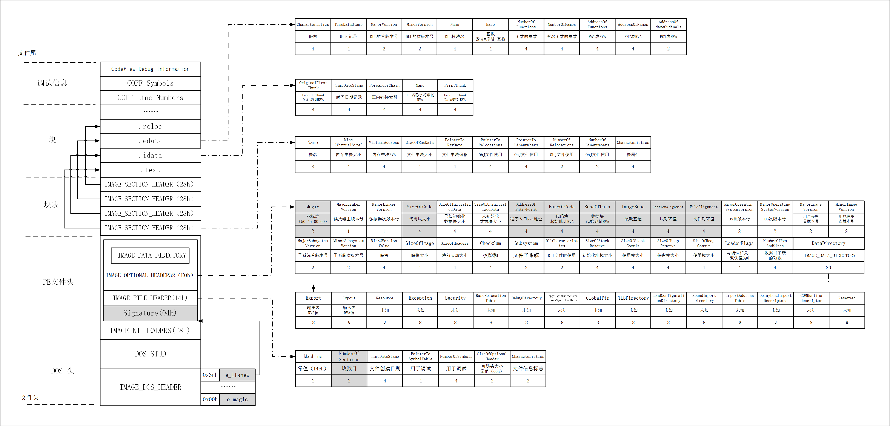
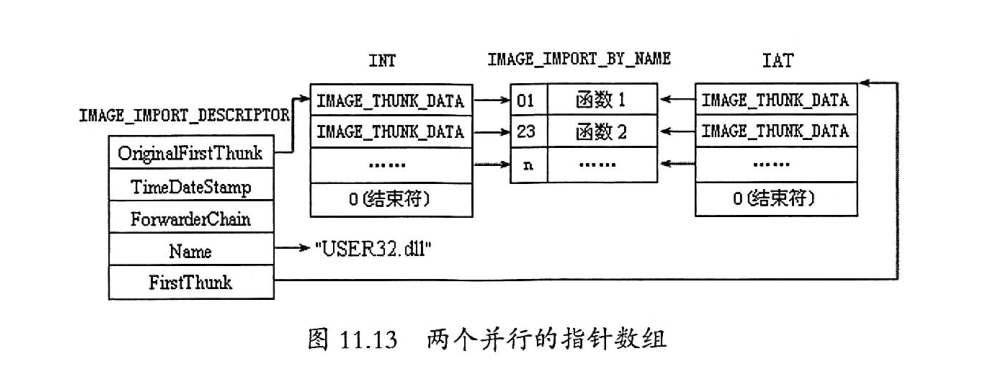
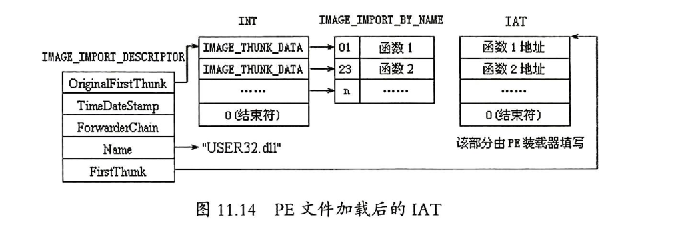
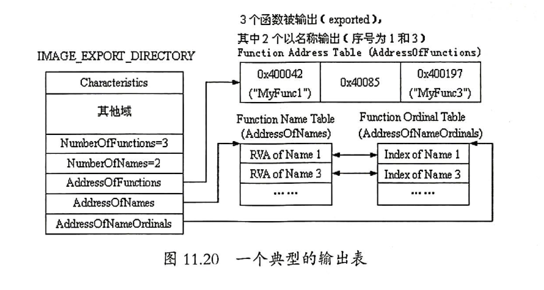

### 0x0 PE文件基本概念

在Win16平台上（Windows3.x），可执行文件格式是`NE`。在Win32平台上（Windows 9x/NT/2000/XP、Server 2003/Vista/CE/7/10），可执行文件格式是`PE`。 PE（Portable Executable File Format）文件是目前Windows平台上的主流可执行文件格式，PE文件衍生于早期建立在VAX/VMS上的`COFF`文件格式（Common Object File Format）

### 0x1 PE文件的框架结构



### 0x2 DOS头（64Bytes）

```
typedef struct IMAGE_DOS_HEADER{
 *    WORD	e_magic;			//DOS可执行文件标记,0x5A4D(MZ)
      WORD	e_cblp;
      WORD	e_cp;
      WORD	e_crlc;
      WORD	e_cparhdr;
      WORD	e_minalloc;
      WORD	e_maxalloc;
      WORD	e_ss;			//DOS代码的初始化堆栈段
      WORD	e_sp;			//DOS代码的初始化堆栈指针
      WORD	e_csum;
      WORD	e_ip;			//DOS代码的入口IP
      WORD	e_cs;			//DOS代码的入口CS
      WORD	e_lfarlc;
      WORD	e_ovno;
      WORD	e_res[4];
      WORD	e_oemid;
      WORD	e_oeminfo;
      WORD	e_res2[10];
 *    DWORD	e_lfanew;             //指向PE文件头
}IMAGE_DOS_HEADER, *PIMAGE_DOS_HEADER;
```

### 0x3 DOS Stub（120Bytes）

### 0x4 PE文件头

紧跟着DOS stub的是PE文件头（PE header），`PE Header`是PE相关结构NT映像头（IMAGE_NT_HEADERS）的简称，其中包含许多PE装载器能用到的重要字段

实际上有两个版本的`IMAGE_NT_HEADERS`结构，一个是PE32（32位）可执行文件，另一个是PE32+（64位），但它们几乎没有什么区别

[**_IMAGE_NT_HEADERS**](https://docs.microsoft.com/zh-cn/windows/win32/api/winnt/ns-winnt-image_nt_headers32)

```
typedef struct IMAGE_NT_HEADERS{
 *    DWORD	Signature;		//PE标志,0x00004550(PE\0\0)
      IMAGE_FILE_HEADER FileHeader;
      IMAGE_OPTIONAL_HEADER32 OptionalHeader;
}IMAGE_NT_HEADERS,*PIMAGE_NT_HEADERS;
```
- [**_IMAGE_FILE_HEADER**](https://docs.microsoft.com/en-us/windows/win32/api/winnt/ns-winnt-image_file_header)

- ```
  typedef struct _IMAGE_FILE_HEADER {
    WORD    Machine;					//运行平台;常用值Intel i386(14ch)
  * WORD    NumberOfSections;			 //文件的区块个数
    DWORD   TimeDateStamp;			//文件创建日期和时间
    DWORD   PointerToSymbolTable;		 //指向符号表（用于调试）
    DWORD   NumberOfSymbols;		     //符号表中符号个数（用于调试）
    WORD    SizeOfOptionalHeader;		 //IMAGE_OPTIONAL_HEADER32结构大小
    WORD    Characteristics;			//文件属性;普通EXE文件值为010fh,DLL文件值为2102h
  } IMAGE_FILE_HEADER, *PIMAGE_FILE_HEADER;
  ```
  - ```
    struct FILE_CHARACTERISTICS Characteristics		//成员可以是以下一个或多个值
    WORD	IMAGE_FILE_RELOCS_STRIPPED				//0×0001
    WORD	IMAGE_FILE_EXECUTABLE_IMAGE				//0×0002
    WORD	IMAGE_FILE_LINE_NUMS_STRIPPED			//0×0004
    WORD	IMAGE_FILE_LOCAL_SYMS_STRIPPED			//0×0008
    WORD	IMAGE_FILE_AGGRESIVE_WS_TRIM			//0×0010
    WORD	IMAGE_FILE_LARGE_ADDRESS_AWARE			//0×0020
    WORD	IMAGE_FILE_BYTES_REVERSED_LO			//0×0080
    WORD	IMAGE_FILE_32BIT_MACHINE				//0×0100
    WORD	IMAGE_FILE_DEBUG_STRIPPED				//0×0200
    WORD	IMAGE_FILE_REMOVABLE_RUN_FROM_SWAP		//0×0400
    WORD 	MAGE_FILE_NET_RUN_FROM_SWAP				//0×0800
    WORD	IMAGE_FILE_SYSTEM					   //0×1000
    WORD	IMAGE_FILE_DLL						   //0×2000
    WORD	IMAGE_FILE_UP_SYSTEM_ONLY				//0x4000
    WORD	IMAGE_FILE_BYTES_REVERSED_HI			//0x8000
    ```
  
- [_IMAGE_OPTIONAL_HEADER](https://docs.microsoft.com/zh-cn/windows/win32/api/winnt/ns-winnt-image_optional_header32)

- ```
  typedef struct _IMAGE_OPTIONAL_HEADER {
      WORD    Magic;							//标志
      BYTE    MajorLinkerVersion;				//链接器主版本号
      BYTE    MinorLinkerVersion;				//链接器次版本号
  *   DWORD   SizeOfCode;						//所有含有代码表的总大小
      DWORD   SizeOfInitializedData;			//所有初始化数据表总大小
      DWORD   SizeOfUninitializedData;		//所有未初始化数据表总大小
  *   DWORD   AddressOfEntryPoint;			//程序执行入口RVA
  *   DWORD   BaseOfCode;						//代码表其实RVA
  *   DWORD   BaseOfData;						//数据表其实RVA
  *   DWORD   ImageBase;						//程序默认装入基地址
  *   DWORD   SectionAlignment;				//内存中表的对齐值
  *   DWORD   FileAlignment;					//文件中表的对齐值
      WORD    MajorOperatingSystemVersion;	//操作系统主版本号
      WORD    MinorOperatingSystemVersion;	//操作系统次版本号
      WORD    MajorImageVersion;				//用户自定义主版本号
      WORD    MinorImageVersion;				//用户自定义次版本号
      WORD    MajorSubsystemVersion;			//所需要子系统主版本号
      WORD    MinorSubsystemVersion;			//所需要子系统次版本号
      DWORD   Win32VersionValue;				//保留，通常设置为0
      DWORD   SizeOfImage;					//映像装入内存后的总大小
      DWORD   SizeOfHeaders;					//DOS头、PE头、区块表总大小
      DWORD   CheckSum;						//映像校验和
      WORD    Subsystem;						//文件子系统，EXE文件有效
      WORD    DllCharacteristics;				//显示DLL特性的旗标
      DWORD   SizeOfStackReserve;				//初始化堆栈大小
      DWORD   SizeOfStackCommit;				//初始化实际提交堆栈大小，默认值4kb
      DWORD   SizeOfHeapReserve;				//初始化保留堆栈大小，默认值1mb
      DWORD   SizeOfHeapCommit;				//初始化实际保留堆栈大小,默认值4kb
      DWORD   LoaderFlags;					//与调试相关，默认值为0
      DWORD   NumberOfRvaAndSizes;			//数据目录表的项数
  *   IMAGE_DATA_DIRECTORY DataDirectory[IMAGE_NUMBEROF_DIRECTORY_ENTRIES];
  } IMAGE_OPTIONAL_HEADER32, *PIMAGE_OPTIONAL_HEADER32;
  ```
  - [_IMAGE_DATA_DIRECTORY](https://docs.microsoft.com/zh-cn/windows/win32/api/winnt/ns-winnt-image_data_directory) 
  
  - ```
    typedef struct _IMAGE_DATA_DIRECTORY {
    *   DWORD   VirtualAddress;			//数据块的起始RVA
    *   DWORD   Size;					//数据块的长度
    } IMAGE_DATA_DIRECTORY, *PIMAGE_DATA_DIRECTORY;
    ```
    
  - ```
    struct IMAGE_DATA_DIRECTORY_ARRAY DataDirArray
    struct IMAGE_DATA_DIRECTORY	Export		//导出表
    |_ DWORD VirtualAddress
    |_ DWORD Size
    *struct IMAGE_DATA_DIRECTORY Import		//导入表
    |_ DWORD VirtualAddress
    |_ DWORD Size
    struct IMAGE_DATA_DIRECTORY	Resource	//资源
    |_ ...
    struct IMAGE_DATA_DIRECTORY Exception
    struct IMAGE_DATA_DIRECTORY Security
    *struct IMAGE_DATA_DIRECTORY BaseRelocationTable
    struct IMAGE_DATA_DIRECTORY DebugDirectory
    struct IMAGE_DATA_DIRECTORY CopyrightOrArchitectureSpecificData
    struct IMAGE_DATA_DIRECTORY GlobalPtr
    struct IMAGE_DATA_DIRECTORY TLSDirectory
    struct IMAGE_DATA_DIRECTORY LoadConfigurationDirectory
    struct IMAGE_DATA_DIRECTORY BoundImportDirectory
    *struct IMAGE_DATA_DIRECTORY ImportAddressTable
    struct IMAGE_DATA_DIRECTORY DelayLoadImportDescriptors
    struct IMAGE_DATA_DIRECTORY COMRuntimedescriptor
    struct IMAGE_DATA_DIRECTORY Reserved
    ```

### 0x5 区块表

紧跟着`IMAGE_NT_HEADERS`的是区块表，它是一个`IMAGE_SECTION_HEADER`结构数组。每个结构中包含它所关联的区块的信息：位置、长度、属性。此外该数组的数目由`IMAGE_NT_HEADERS.FileHeader.NumberOfSections`决定

[_IMAGE_SECTION_HEADER](https://docs.microsoft.com/en-us/windows/win32/api/winnt/ns-winnt-image_section_header)

```
typedef struct _IMAGE_SECTION_HEADER {
  BYTE  Name[IMAGE_SIZEOF_SHORT_NAME];	//8字节的块名
  union {				
    DWORD PhysicalAddress;
    DWORD VirtualSize;
  } Misc;							 //区块尺寸
  DWORD	VirtualAddress;				  //区块的RVA地址
  DWORD	SizeOfRawData;				  //在文件中对齐后的尺寸
  DWORD PointerToRawData;			  //在文件中的偏移
  DWORD PointerToRelocations;		  //在obj文件中使用，重定位的偏移
  DWORD PointerToLinenumbers;		  //行号表的偏移(调试所用)
  WORD  NumberOfRelocations;		  //在obj文件中使用，重定位项数目
  WORD  NumberOfLinenumbers;		  //行号表中行号的数目
  DWORD Characteristics;			  //区块的属性
} IMAGE_SECTION_HEADER, *PIMAGE_SECTION_HEADER;
```

- ```
  struct SECTION_CHARACTERISTICS Characteristics		//成员可以是以下一个或多个值
  ULONG IMAGE_SCN_TYPE_NO_PAD						  //0x00000008
  ULONG IMAGE_SCN_CNT_CODE						//0x00000010
  ULONG IMAGE_SCN_CNT_INITIALIZED_DATA				//0x00000040
  ULONG IMAGE_SCN_CNT_UNINITIALIZED_DATA				//0x00000080
  ULONG IMAGE_SCN_LNK_OTHER						//0x00000100
  ULONG IMAGE_SCN_LNK_INFO						//0x00000200
  ULONG IMAGE_SCN_LNK_REMOVE						//0x00000800
  ULONG IMAGE_SCN_LNK_COMDAT						//0x00001000
  ULONG IMAGE_SCN_GPREL							//0x00008000
  ULONG IMAGE_SCN_MEM_16BIT						//0x00500000
  ULONG IMAGE_SCN_MEM_LOCKED						//0x00040000
  ULONG IMAGE_SCN_MEM_PRELOAD						//0x00080000
  ULONG IMAGE_SCN_ALIGN_1BYTES
  ULONG IMAGE_SCN_ALIGN_2BYTES
  ULONG IMAGE_SCN_ALIGN_8BYTES
  ULONG IMAGE_SCN_ALIGN_128BYTES
  ULONG IMAGE_SCN_LNK_NRELOC_OVFL					//0x01000000
  ULONG IMAGE_SCN_MEM_DISCARDABLE					//0x02000000
  ULONG IMAGE_SCN_MEM_NOT_CACHED					//0x04000000
  ULONG IMAGE_SCN_MEM_NOT_PAGED					//0x08000000
  ULONG IMAGE_SCN_MEM_SHARED						//0x10000000
  ULONG IMAGE_SCN_MEM_EXECUTE						//0x20000000
  ULONG IMAGE_SCN_MEM_READ						//0x40000000
  ULONG IMAGE_SCN_MEM_WRITE						//0x80000000
  ```


### 0x6 常见区块

| 名称     | 描述                                                         |
| -------- | ------------------------------------------------------------ |
| `.text`  | 默认的代码块，它的内容全是指令代码。如果使用Borland C++，其编译器将产生的代码存储于名为`code`的区域 |
| `.data`  | 默认的读/写数据块。全局变量、静态变量一般也放在这里          |
| `.rdata` | 默认的只读数据块。程序很少用到该块中的数据，至少有两种情况需要用到：<br />1. Microsoft链接器产生的EXE文件中，用于存放调试目录<br />2. 用于存放说明字符串 |
| `.idata` | 存放外来DLL的函数以及数据信息（输入表）                      |
| `.bss`   | 未初始化数据；较少使用，取而代之的是可执行文件的`.data`区块的`VirtualSize`被扩展到足够大以存放未初始化的数据 |
| `.rsrc`  | 包含模块的全部资源：图标、菜单、位图等；只读区块，区块名唯一；不能合并到其他区块里 |

### 0x7 输入表

可执行文件使用来自其他DLL中的代码或数据的动作称为输入。当PE文件被载入到内存时，Windows加载器的工作之一就是定位所有被输入的函数和数据，并让正在载入的文件可以使用那些地址，这个过程是通过PE文件的输入表（Import Table，IT）完成的。输入表中保存的是函数名和其驻留的DLL名等动态链接所需的信息

链接方式：
 - 隐式链接：当应用程序调用一个DLL的代码和数据时，它就被隐式链接到DLL，这个过程由windows加载器完成

- 显式链接：运行期的显式链接，意味着必须确定目标DLL已经被加载，然后寻找API的地址。几乎是通过调用`LoadLibrary`和`GetProcAddress`函数完成

- ```
  STRUCT IAMGE_IMPORT_DESCRIPTOR
  {
      union
      {
          DWORD Characteristics;
          DWORD OriginalFirstThunk;    //指向输入名称表（INT）的RVA
      }
      DWORD TimeDateStamp;             //一个32位的时间标志
      DWORD ForwarderChain;            //这是一个被转向API的索引，一般为0
      DWORD Name;                      //DLL名字,是个以00结尾的ASCII字符的RVA地址
      DWORD FirstThunk;                //指向输入地址表（IAT）的RVA
  } ;
  ```
  
  `OriginalFirstThunk`与`FirstThunk`相似，它们分别指向两个本质上相同的`IMAGE_THUNK_DATA`结构，称为输入名称表（Import Name Table，INT）或输入地址表（Import Address Table，IAT）

  
  
  - ```
    STRUCT IMAGE_THUNK_DATA
    {
        union u1
          DWORD ForwarderString;    //指向一个转向者字符串的RVA
          DWORD Function;           //被输入的函数的内存地址
          DWORD Ordinal;            //被输入的API的序数值
          DWORD AddressOfData;      //指向IAMGE_IMPORT_BY_NAME
        ends
  };
    ```
  
  - ```
      STRUCT  IAMGE_IMPORT_BY_NAME
      {
          WORD Hint;    //本函数在其所驻留DLL的输出表中的序号 
          BYTE  Name;     //输入函数的函数名,函数名是一个ASCII码字符串,以NULL结尾
      };
      ```
  

### 0x8 输入地址表

有两个并行的指针数组指向`IAMGE_IMPORT_BY_NAME`结构：

1. 第一个数组（由`OriginalFirstThunk`所指向）是单独的一项，而且不可改变，成为`INT`
2. 第二个数组（由`FirstThunk`所指向）由PE装载器重写

PE装载器首先搜索`OriginalFirstThunk`，如果找到了，加载程序迭代搜索数组中的每个指针，找到每个 `IMAGE_IMPORT_BY_NAME `结构所指向的输入函数的地址，然后加载器用函数真实入口地址来代替由`FirstThunk`指向的 `IAMGE_IMPORT_BY_NAME `数组所指向数组里的元素值，`JMP dword ptr[xxxxxxxx]`中的`[xxxxxxxx]`指向`FirstThunk `数组中的一个入口，所以当PE文件装载内存后准备执行时，所有函数入口地址被排列在一起，此时输入表中其他就不重要的，依靠`IAT`提供地址就可以正常运行



有些情况下函数仅由序号引出，也就是说不能用函数名来调用它，只能通过位置调用它，此时 `IMAGE_THUNK_DATA `值的低位字指示函数序数，最高有效位（`MSB`）设为`1`，微软提供了一个方便的常量测量`DWORD`值的`MSB`位，就是 `IMAGE_ORDINAL_FLAG32`，其值是`80000000h`

另一种情况是程序的 `OriginalFirstThunk `的值为`0`，初始化时，系统根据`FirstThunk `的值指向函数名的地址串，由地址串找到函数名，再根据函数名入口地址，然后用入口地址取代 `FirstThunk `指向的地址串的原值

### 0x9 输出表

创建一个DLL时，实际上创建了一组能让EXE或其他DLL调用的函数，此时PE装载器根据DLL文件中输出的信息修正被执行文件的IAT。当一个DLL函数能被EXE或另一个DLL文件使用时，它就被“输出（Exported）”了。其中，输出信息被保存在输出表中，DLL文件通过输出表向系统提供输出函数名、序号和入口地址等信息

EXE文件一般不存在输出表，而大部分DLL文件中存在输出表

```
typedef struct IMAGE_EXPORT_DIRECTORY {
    DWORD   Characteristics;
    DWORD   TimeDateStamp;
    WORD    MajorVersion;
    WORD    MinorVersion;
    DWORD   Name;				   //模块的真实名称
    DWORD   Base;				   //基数，序数减这个基数就是函数地址数组的索引值
    DWORD   NumberOfFunctions;
    DWORD   NumberOfNames;
    DWORD   AddressOfFunctions;     // 指向函数地址数组
    DWORD   AddressOfNames;         // 函数名字的指针地址
    DWORD   AddressOfNameOrdinals;  // 指向输出序列号数组
} IMAGE_EXPORT_DIRECTORY, *PIMAGE_EXPORT_DIRECTORY;
```




### 原文

- 《加密与解密》第四版


