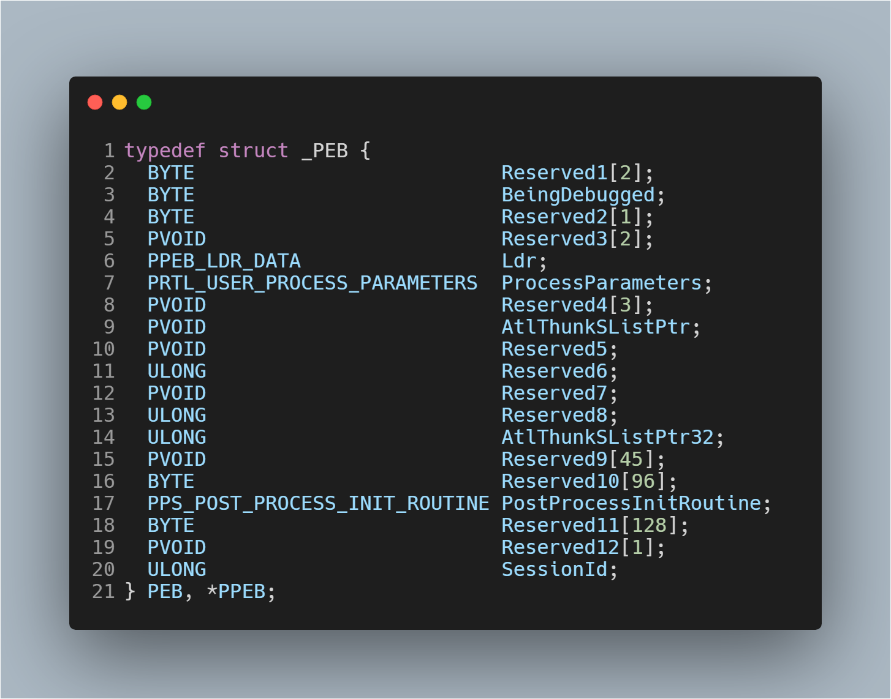
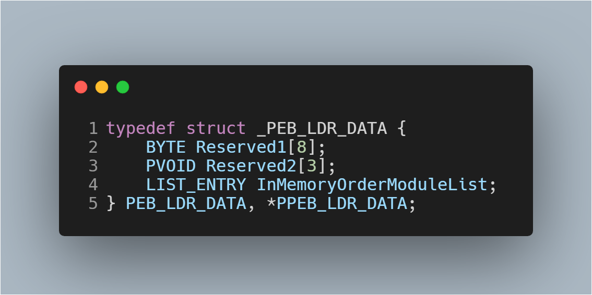
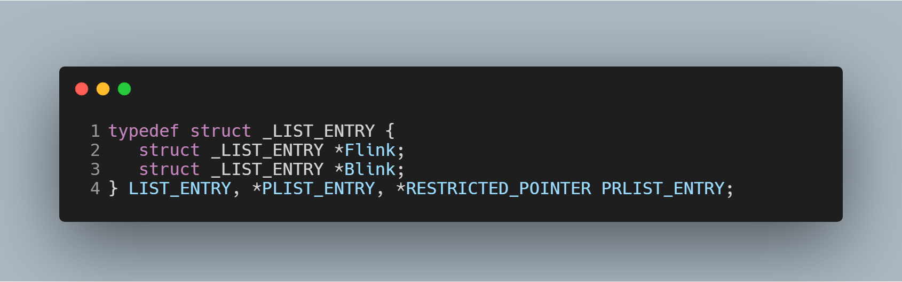
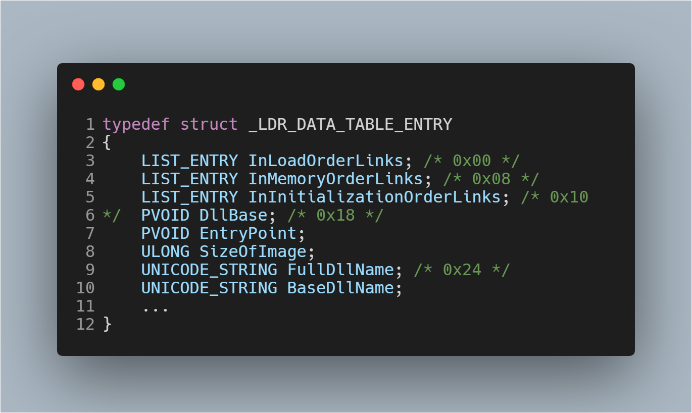
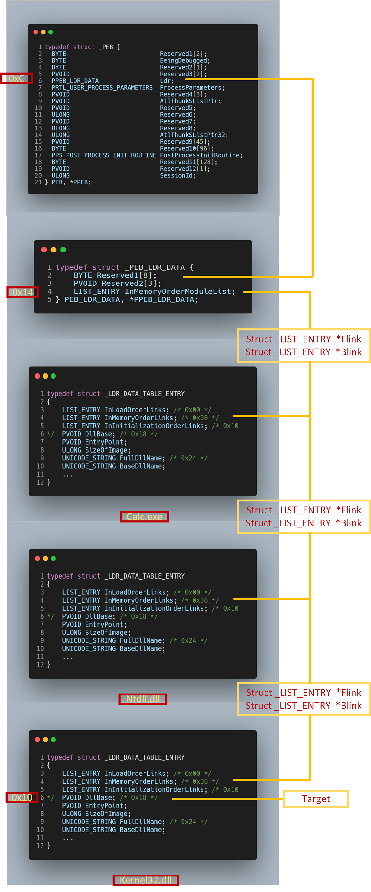

## Windows x86 shellcode

### 主要步骤

1. 获取  *kernel32.dll*  基地址
2. 找到 *GetProcAddress* 函数的地址
3. 使用 *GetProcAddress* 查找 *LoadLibrary* 函数的地址
4. 使用*LoadLibrary*加载 DLL（例如*user32.dll*）
5. 使用*GetProcAddress*查找函数的地址（如*MessageBox*）
6. 指定功能参数
7. 调用该函数

### PEB [^1]

- #### PEB 结构

- 字段（x86）	

  | 字段类型      | 大小    |
  | ------------- | ------- |
  | BYTE          | 1 Byte  |
  | PVOID（指针） | 4 Bytes |

- ==*Ldr*== 指针偏移 ==`0xC`==（12 Bytes）

- #### PEB_LDR_DATA结构

  

- ==*InMemoryOrderModuleList*== 偏移==` 0x14`== （20 Bytes）[^2]

- #### LIST_ENTRY 结构

  

- #### LDR_DATA_TABLE_ENTRY结构

  

- ==*DllBase*== 偏移 ==`0x18`== （24 Bytes）

### 查找*kernel32.dll*内存地址所需的所有必要步骤的流程图

---

[^1]: PEB（Process Environment Block，进程环境块）: 是一种可用于内存中固定地址的每个进程的结构。此结构包含有关进程的有用信息，例如：可执行文件加载到内存中的地址，模块列表（DLL），指定进程是否正在调试的标志等。此外[该结构](https://docs.microsoft.com/zh-cn/windows/win32/api/winternl/ns-winternl-_peb)（或者*winternl.h*）旨在由操作系统使用，它在不同的Windows系统版本中不一致，因此每个新的Windows版本都可能会发生变化，但保留了一些常见信息
[^2]: 提供有关已加载DLL的使用信息，即提供以下**顺序**所有加载的模块列表：`calc.exe`（可执行文件）`ntdll.dll`和 `KERNEL32.DLL`