## FakeImageExploiter v1.4 - agent.jpg.exe

### 说明

- 该模块采用一个现有的image.jpg和一个payload.ps1（由用户输入）来构建一个新的有效负载（agent.jpg.exe），如果执行它将会触发下载之前存储在apache2 webserver上的两个文件（image.jpg + payload.ps1）
- 此模块还可以更改有效负载图标通过匹配输入image.jpg，然后使用隐藏已知文件扩展名来隐藏.exe扩展名（final：agent.jpg.exe） 
- 这个工具还构建了一个cleaner.rc文件来删除目标中剩余的有效负载
- [技术参考](https://null-byte.wonderhowto.com/how-to/hide-virus-inside-fake-picture-0168183/)

### 代码

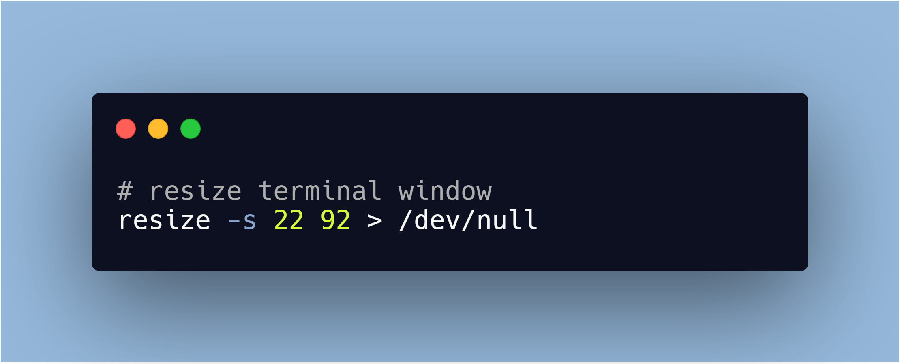 

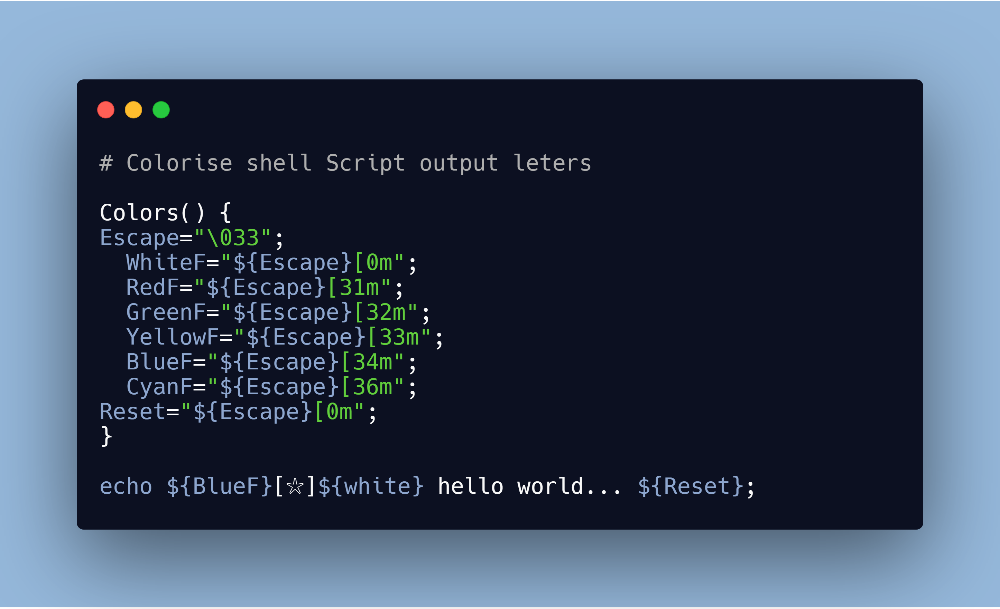

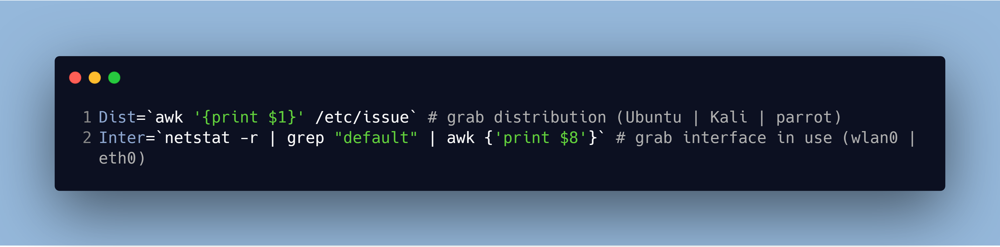

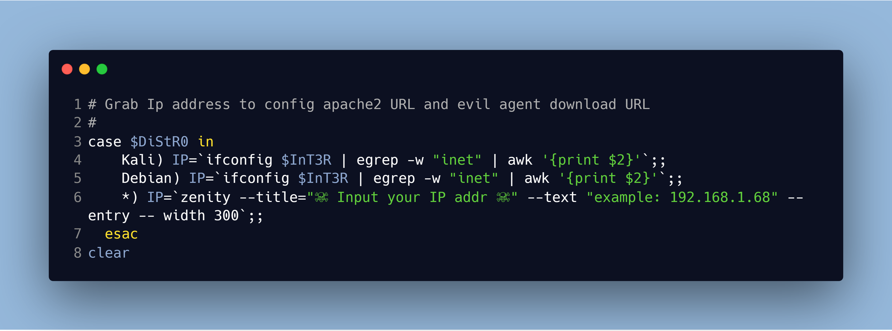

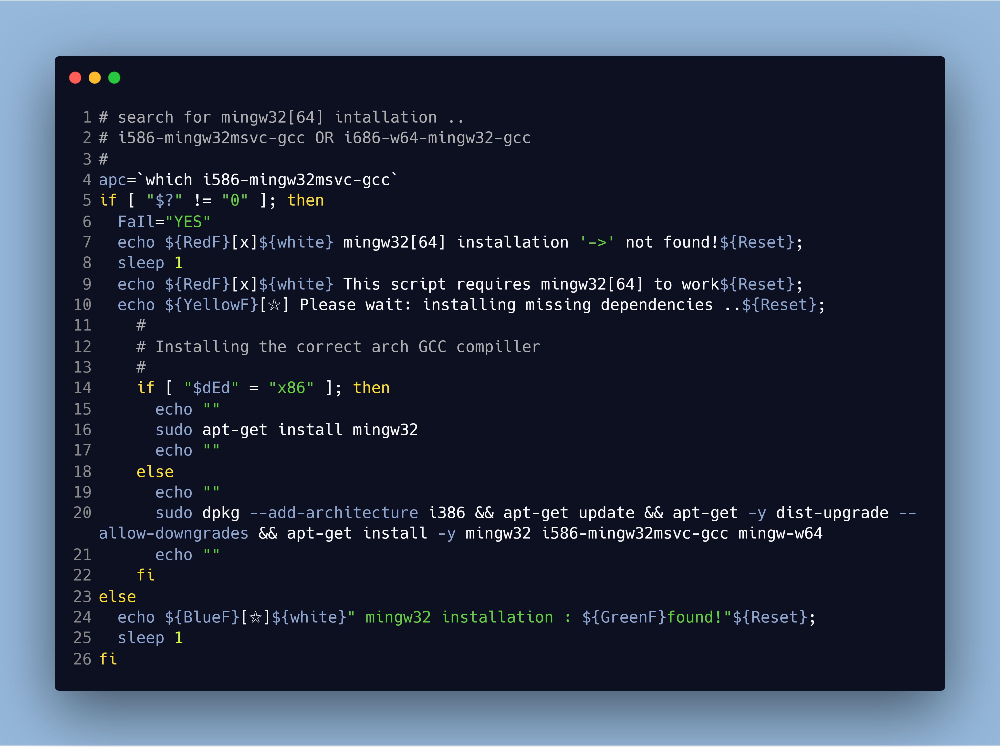

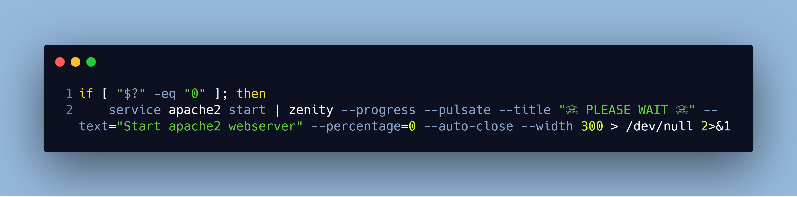

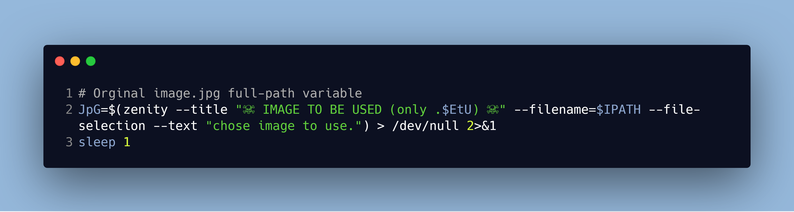

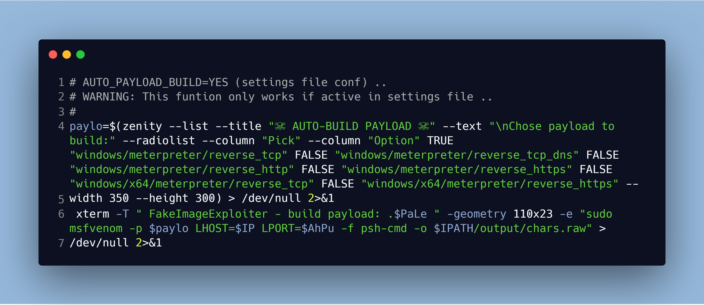

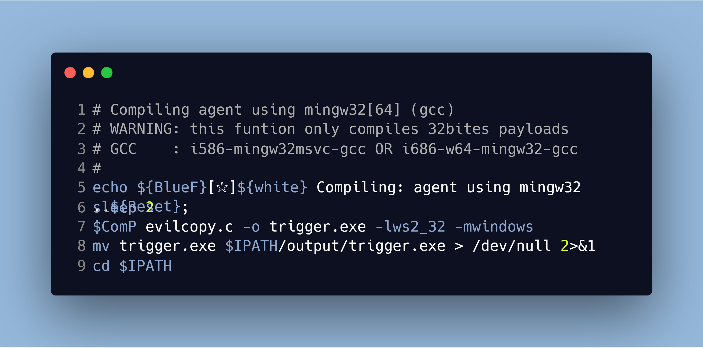

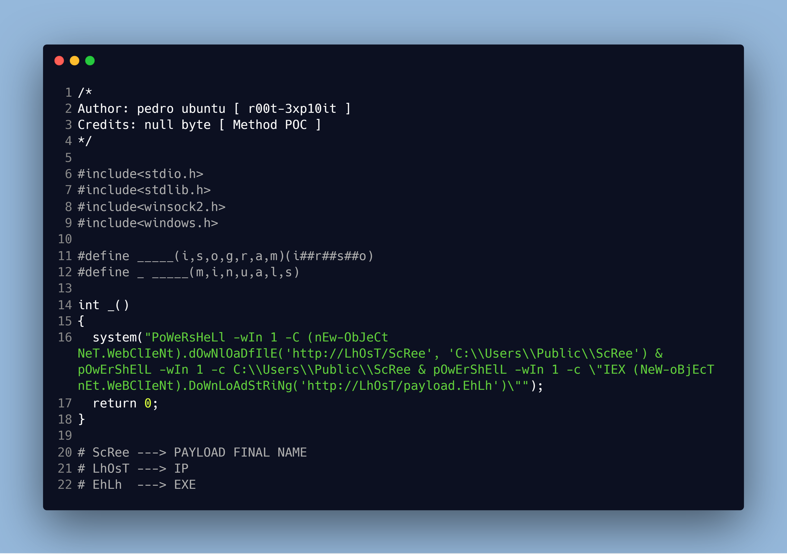

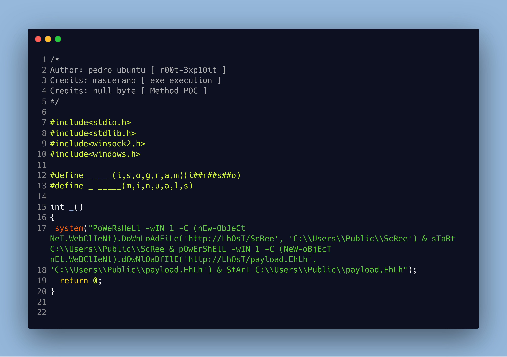

---

[项目地址](https://github.com/r00t-3xp10it/FakeImageExploiter)