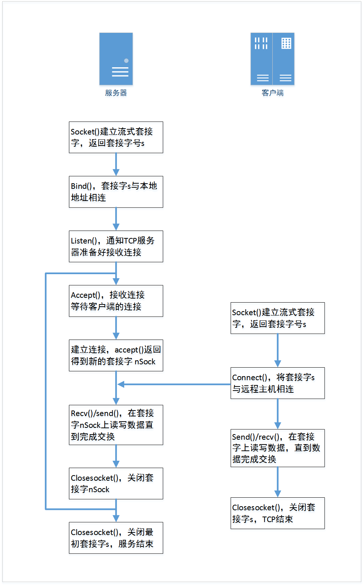

### Winsock[^1]

### Winsock头文件及库文件

| 版本     | 头文件       |               |
| -------- | ------------ | ------------- |
| Winsock1 | `winsock.h`  | `wsock32.lib` |
| Winsock2 | `winsock2.h` | `ws2_32.lib`  |
|          | `mswsock.h`  | `mswsock.lib` |

### 具体流程

---

[^1]: 是一种标准API（应用程序编程接口），主要用于网络中的数据通信；允许两个或多个应用程序（或进程）在同一台机器上或通过网络相互通信