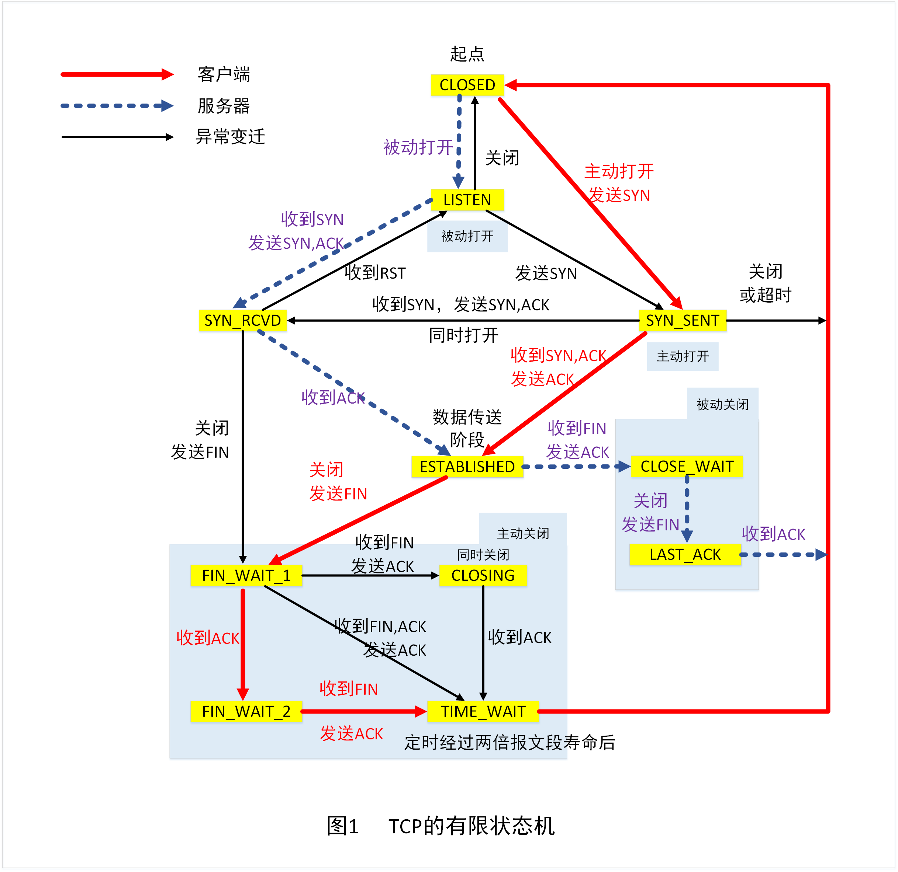

### TCP 状态转换



### `Connect()`函数[^1]

```c
int	connect(
	SOCKET s,
	const struct sockaddr FAR * name, //表示要连接到的服务器
	int namelen
);
```

### 部分示例

[tcp_client](../doc/tcp_client.cpp)


---

[^1]: 连接套接字通过调用 `connect()`、`WSAConnect()`或`ConnectEx()`来完成