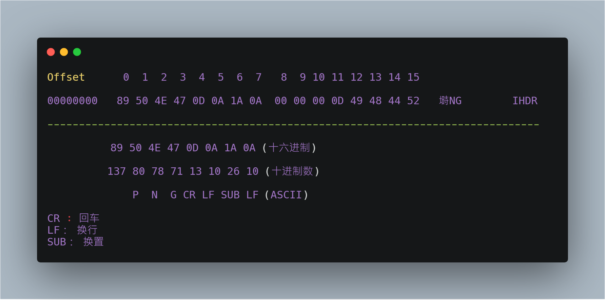
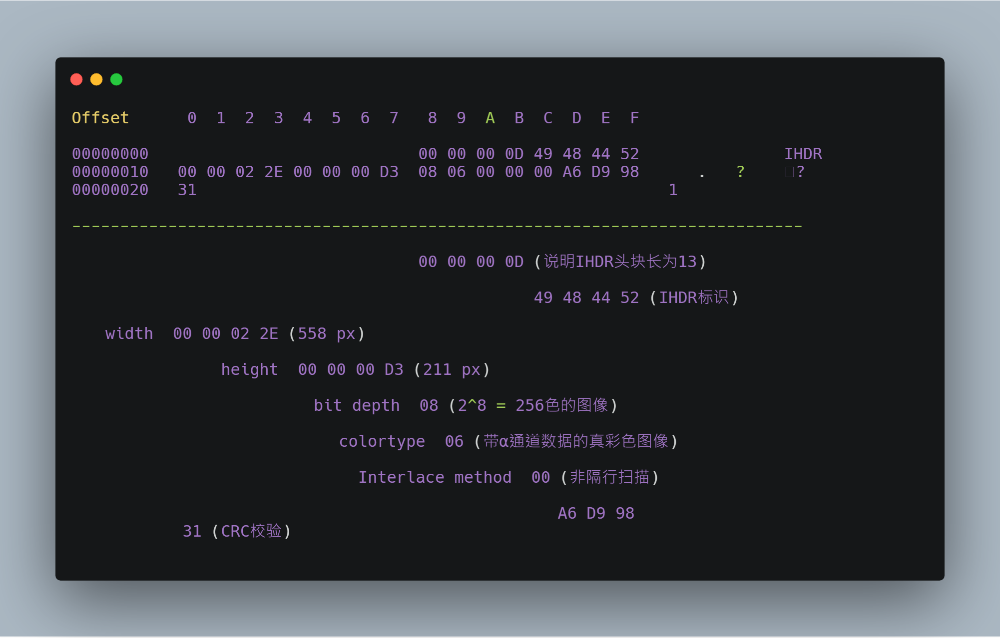

## PNG文件格式分析

### PNG头文件结构 [^1]

### PNG数据块（Chunk）

- 关键数据块(critical chunk)，这是标准的数据块 [^2]
- 辅助数据块(ancillary chunks)，这是可选的数据块

### PNG文件格式中的数据块

| 数据块符号 | 数据块名称             | 多数据块 | 可选否 | 位置限制           |
| ---------- | ---------------------- | -------- | ------ | ------------------ |
| ==IHDR==   | 文件头数据块           | 否       | 否     | 第一块             |
| cHRM       | 基色和白色点数据块     | 否       | 是     | 在PLTE和IDAT之前   |
| gAMA       | 图像γ数据块            | 否       | 是     | 在PLTE和IDAT之前   |
| sBIT       | 样本有效位数据块       | 否       | 是     | 在PLTE和IDAT之前   |
| ==PLTE==   | 调色板数据块           | 否       | 是     | 在IDAT之前         |
| bKGD       | 背景颜色数据块         | 否       | 是     | 在PLTE之后IDAT之前 |
| hIST       | 图像直方图数据块       | 否       | 是     | 在PLTE之后IDAT之前 |
| tRNS       | 图像透明数据块         | 否       | 是     | 在PLTE之后IDAT之前 |
| oFFs       | (专用公共数据块)       | 否       | 是     | 在IDAT之前         |
| pHYs       | 物理像素尺寸数据块     | 否       | 是     | 在IDAT之前         |
| sCAL       | (专用公共数据块)       | 否       | 是     | 在IDAT之前         |
| ==IDAT==   | 图像数据块             | 是       | 否     | 与其他IDAT连续     |
| tIME       | 图像最后修改时间数据块 | 否       | 是     | 无限制             |
| tEXt       | 文本信息数据块         | 是       | 是     | 无限制             |
| zTXt       | 压缩文本数据块         | 是       | 是     | 无限制             |
| fRAc       | (专用公共数据块)       | 是       | 是     | 无限制             |
| gIFg       | (专用公共数据块)       | 是       | 是     | 无限制             |
| gIFt       | (专用公共数据块)       | 是       | 是     | 无限制             |
| gIFx       | (专用公共数据块)       | 是       | 是     | 无限制             |
| ==IEND==   | 图像结束数据           | 否       | 否     | 最后一个数据块     |

### 数据块结构 [^3]

| 名称                           | 字节数   | 说明                                                |
| ------------------------------ | -------- | --------------------------------------------------- |
| Length (长度)                  | 4字节    | 指定数据块中数据域的长度，其长度不超过(2^31－1)字节 |
| Chunk Type Code (数据块类型码) | 4字节    | 数据块类型码由ASCII字母(A-Z和a-z)组成               |
| Chunk Data (数据块数据)        | 可变长度 | 存储按照Chunk Type Code指定的数据                   |
| CRC (循环冗余检测)             | 4字节    | 存储用来检测是否有错误的循环冗余码                  |

### IHDR [^4]

| 域的名称           | 字节数  | 说明                                                         |
| ------------------ | ------- | ------------------------------------------------------------ |
| Width              | 4 bytes | 图像宽度，以像素为单位                                       |
| Height             | 4 bytes | 图像高度，以像素为单位                                       |
| Bit depth          | 1 byte  | 图像深度：  索引彩色图像：1，2，4或8  灰度图像：1，2，4，8或16  真彩色图像：8或16 |
| ColorType          | 1 byte  | 颜色类型： 0：灰度图像, 1，2，4，8或16  2：真彩色图像，8或16  3：索引彩色图像，1，2，4或8  4：带α通道数据的灰度图像，8或16  6：带α通道数据的真彩色图像，8或16 |
| Compression method | 1 byte  | 压缩方法(LZ77派生算法)                                       |
| Filter method      | 1 byte  | 滤波器方法                                                   |
| Interlace method   | 1 byte  | 隔行扫描方法：  0：非隔行扫描  1： Adam7(由Adam M. Costello开发的7遍隔行扫描方法) |

### PLTE [^7]

| 颜色  | 字节   | 意义                 |
| ----- | ------ | -------------------- |
| Red   | 1 byte | 0 = 黑色, 255 = 红   |
| Green | 1 byte | 0 = 黑色, 255 = 绿色 |
| Blue  | 1 byte | 0 = 黑色, 255 = 蓝色 |

- 调色板的长度是3的倍数
- 对于索引图像，调色板信息是必须的，调色板的颜色索引从0开始编号，然后是1、2……
- 调色板的颜色数不能超过色深中规定的颜色数（如图像色深为4的时
  候，调色板中的颜色数不可以超过2^4=16），否则这将导致PNG图像不合法
- 真彩色图像和带α通道数据的真彩色图像也可以有调色板数据块，目的是便于非真彩色显示程序用它来量化图像数据，从而显示该图像

### IDAT [^5]

### IEND [^6]

### Ref.

- [PNG规范](http://www.libpng.org/pub/png/spec/1.2/PNG-Contents.html)

[原文](https://www.xuebuyuan.com/3189742.html)

---

[^1]: 第一个字节 `0x89` 超出了 ASCII 字符的范围，这是为了避免某些软件将PNG文件当做文本文件来处理。文件中剩余的部分由3个以上的PNG的数据块 （Chunk）按照特定的顺序组成
[^2]: 关键数据块定义了**4**个标准数据块，每个PNG文件都必须包含它们，PNG读写软件也都必须要支持这些数据块
[^3]: PNG文件中，每个数据块由4个部分组成
[^4]: 文件头数据块 IHDR(header chunk)：它包含有PNG文件中存储的图像数据的基本信息，作为第一个数据块出现在PNG数据流中，并且一个PNG数据流中只能有一个文件头数据块。文件头数据块由**13字节**组成，它的格式如下表
[^5]: 图像数据块 IDAT(image data chunk)：它存储实际的数据，在数据流中可包含多个连续顺序的图像数据块
[^6]: 图像结束数据 IEND(image trailer chunk)：它用来标记PNG文件或者数据流已经结束，并且必须要放在文件的尾部
[^7]: 调色板数据块 PLTE(palette chunk)包含有与索引彩色图像(indexed-color image)相关的彩色变换数据，它仅与索引彩色图像有关，而且要放在图像数据块(image data chunk)之前。PLTE 数据块是定义图像的调色板信息，PLTE 可以包含1~256个调色板信息，每一个调色板信息由3个字节组成